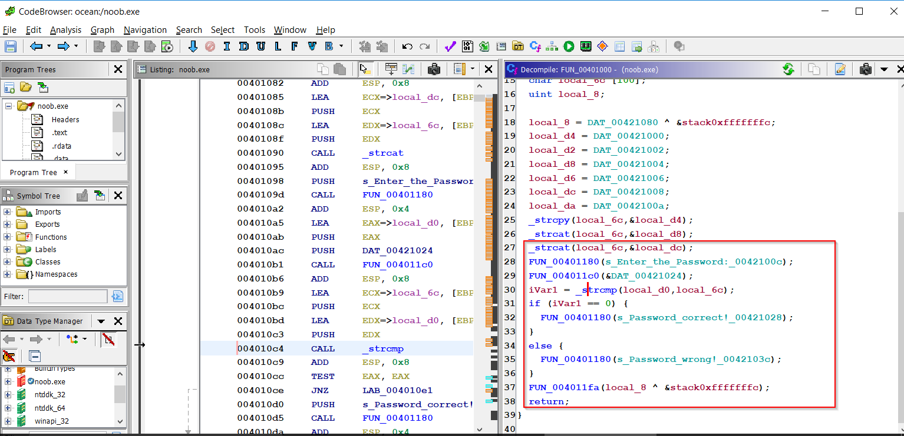

This is the first binary of the day in my "Two in a Day" reverse engineering streak where i reverse two binaries in a day. I started with an easy one. 

"Challenge name": "crack the password by abc00012345"
"Difficulty": "easy"
"tools needed": "Ghidra and x32 debugger"
"Description of the challenge" "Identify the password that prompts you to enter while executing the binary"

Step1: Identify the string "enter the password" in "Defined Strings" in "Ghidra" 
Step2: Find the references to the string in the binary, that takes us to the function in which the string "enter the password" is referenced.

# Function's Decompilation

Here is the decompiled function:

As we observe the function, a function takes the input and compares with a string using "_strcmp" function. To find the password, open the binary in the debugger.
Set the breakpoints at the function which takes the password and also on the "_strcmp" to identify the password

